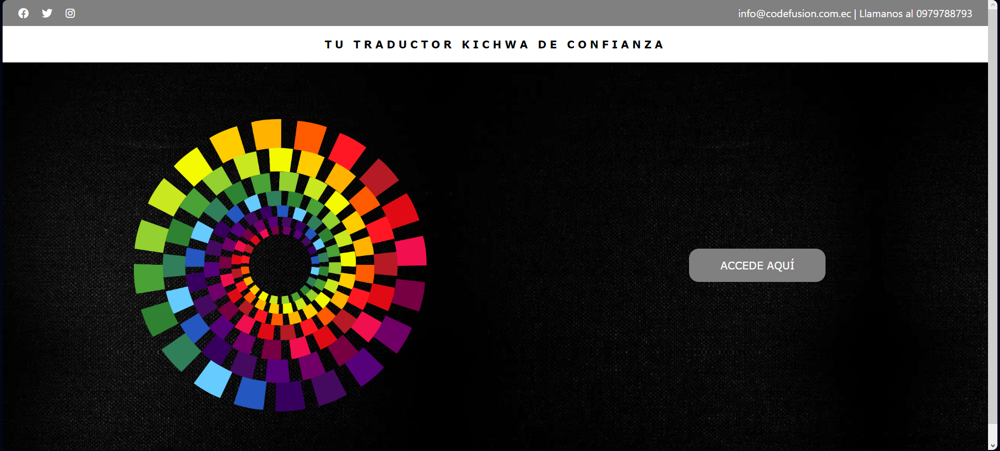
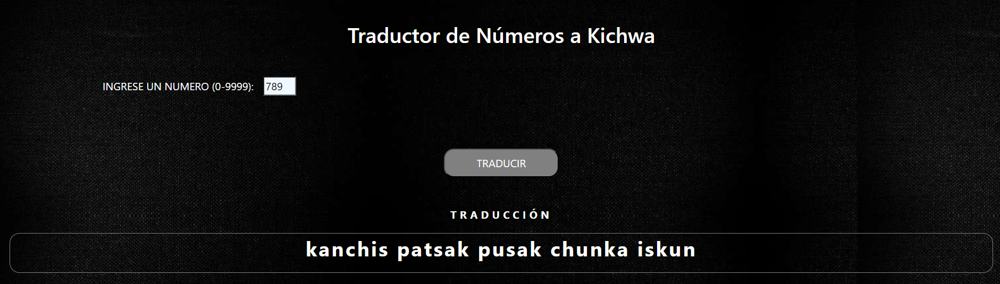

# Manual de Usuario

## Resumen
En este documento se presenta un manual completo del funcionamiento del programa Traductor de Kichwa Versión 2 para el usuario.

## Inicio

1. Para ingresar al programa se debe ingresar al siguiente enlace: https://sleoncamacho.github.io/CalidadCodeFusion/
2. Presionar el botón "ACCEDE AQUÍ" para acceder al traductor

## Traductor

1. En el campo de texto "INGRESE UN NUMERO (0-9999):" se ingresa el número entero deseado

> Advertencia: Solo se debe ingresar un número entero en notación arábiga dentro del rango especificado, de otro modo, el sistema no le permitirá realizar la traducción.

1. Presionar el botón "TRADUCIR"

2. Visualizar en el campo "TRADUCCIÓN" la traducción del número ingresado a kichwa en forma textual

## Salida del sistema
1. Si desea salir del traductor, presione el botón "SALIR"

